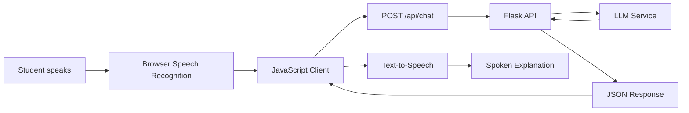

# StudyVoice — Voice-first AI Study Assistant

A polished personal AI project that lets students ask questions out loud, routes the transcript through an LLM-backed REST API, and speaks back a concise explanation in real time.

> Built to explore the same core product loop behind production voice agents: **capture intent → call backend systems → generate a useful response → return it naturally → handle failures gracefully.**

## Demo

The app includes an **interactive demo mode**. Click **Watch demo** on the landing page and StudyVoice will simulate the full voice workflow end to end:

1. Capture a spoken study question
2. Convert the question into text
3. Send it through the backend API
4. Generate a concise explanation
5. Read the response aloud

The demo works even without an API key, so anyone reviewing the repository can see the product flow immediately.

## Features

- **Voice-first interaction** using browser speech recognition
- **Text-to-speech responses** for a conversational study experience
- **Python + Flask backend** with a clean REST API
- **LLM integration layer** through an OpenAI-compatible endpoint
- **Interactive scripted demo** for zero-setup product walkthroughs
- **Prompt shortcuts** for common study workflows
- **Graceful fallback mode** when no model credentials are configured
- **Health-check endpoint** for deployment monitoring
- **Responsive product UI** designed for desktop and mobile

## Tech stack

**Frontend:** JavaScript, HTML, CSS, Web Speech API  
**Backend:** Python, Flask, REST APIs  
**AI:** LLM API integration, prompt orchestration  
**Voice:** Speech-to-text + browser text-to-speech

## Architecture



## Request flow

```text
Voice input
   ↓
Speech recognition
   ↓
JavaScript client
   ↓
POST /api/chat
   ↓
Input validation
   ↓
LLM request / fallback mode
   ↓
Structured response
   ↓
UI render + text-to-speech
```

## Run locally

```bash
python -m venv .venv
source .venv/bin/activate      # Windows: .venv\Scripts\activate
pip install -r requirements.txt
cp .env.example .env
python app.py
```

Then open:

```text
http://localhost:5000
```

The project runs in built-in demo/fallback mode without credentials.

To connect an LLM, configure:

```env
LLM_API_URL=
LLM_API_KEY=
LLM_MODEL=
PORT=5000
```

## API

### `POST /api/chat`

Request:

```json
{
  "message": "Explain generating functions simply"
}
```

Response:

```json
{
  "reply": "A generating function packages a sequence into a power series..."
}
```

### `GET /api/health`

```json
{
  "status": "ok"
}
```

## Why I built it

I wanted to build something I would actually use while studying, but I also wanted to understand what makes a voice AI product feel usable beyond the model itself.

The interesting part was the full system around the LLM: capturing intent, moving data through APIs, handling browser support, managing voice states, designing short spoken responses, and creating fallbacks when an external service fails.

## What I would add for production

A real production voice agent needs much more than a successful model call. The next version would focus on:

- **Streaming responses** to reduce perceived latency
- **Interruptions / barge-in** so users can naturally cut off the assistant
- **Conversation memory** across multi-turn study sessions
- **Retrieval over course notes** for grounded, course-specific answers
- **Retry, timeout, and fallback policies** for model/API failures
- **Tracing + latency metrics** across speech, model, and response stages
- **Evaluation suites** for accuracy, hallucination rate, and response consistency
- **Authentication and rate limiting** for deployed use
- **Dockerized deployment** and CI checks

## Project structure

```text
studyvoice-ai/
├── app.py
├── requirements.txt
├── .env.example
├── .gitignore
├── README.md
└── static/
    ├── index.html
    ├── app.js
    └── style.css
```

## Resume bullet

**StudyVoice — AI Voice Assistant** | Python, JavaScript, Flask, REST APIs, LLMs  
Built a voice-first AI assistant that converts spoken questions into LLM responses and returns real-time voice answers through an end-to-end speech, API, and text-to-speech workflow.

## Repository

https://github.com/risha-shah/studyvoice-ai
